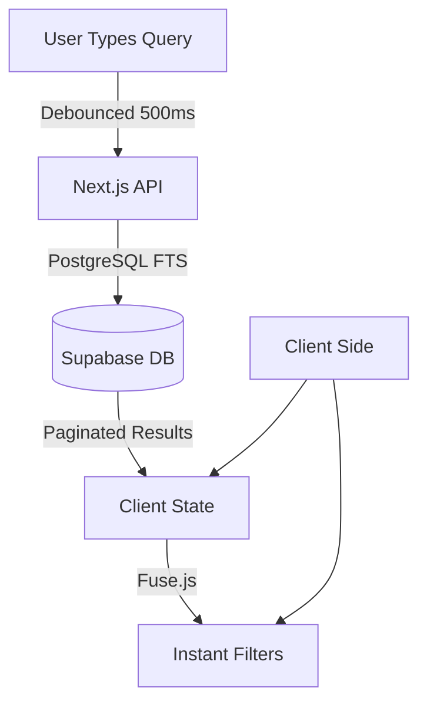

# Annotation System

## Overview

The Annotation System allows users to highlight text, add notes, categorize them, and search through them efficiently. The system has evolved from client-side only search to a hybrid approach using **PostgreSQL Full-Text Search (FTS)** for scalability and **Fuse.js** for instant client-side interactions.

---

## 1. Annotation Categories

Users can categorize annotations into 7 distinct types, each with unique visual styling and filtering capabilities.

### Supported Categories

| Category | Icon | Color | Use Case |
|----------|------|-------|----------|
| **General** | 📝 | Gray | Default category for general notes |
| **Important** | ⭐ | Red | Critical information, key insights |
| **Question** | ❓ | Blue | Questions to research or clarify |
| **Insight** | 💡 | Yellow | Personal revelations or connections |
| **To Research** | 🔍 | Purple | Topics requiring further investigation |
| **Quote** | 💬 | Green | Notable quotes to remember |
| **Critique** | 🎯 | Orange | Critical analysis or disagreements |

### Color Coding Reference

Each category uses a specific color scheme for badges and highlights:

```css
Red (Important):     bg-red-500/10 text-red-400 border-red-500/20
Blue (Question):     bg-blue-500/10 text-blue-400 border-blue-500/20
Yellow (Insight):    bg-yellow-500/10 text-yellow-400 border-yellow-500/20
Purple (Research):   bg-purple-500/10 text-purple-400 border-purple-500/20
Green (Quote):       bg-green-500/10 text-green-400 border-green-500/20
Orange (Critique):   bg-orange-500/10 text-orange-400 border-orange-500/20
Gray (General):      bg-zinc-700/50 text-zinc-400 border-zinc-600/20
```

### Database Schema

```sql
ALTER TABLE user_annotations 
ADD COLUMN category TEXT DEFAULT 'general' 
CHECK (category IN ('general', 'important', 'question', 'insight', 'to-research', 'quote', 'critique'));

CREATE INDEX idx_user_annotations_category ON user_annotations(category);
```

### UI Implementation

- **Visual Badges:** Color-coded badges display on each annotation.
- **Filtering:** Filter buttons allow toggling visibility of specific categories.
- **Defaults:** New annotations default to 'general'.

---

## 2. Search Architecture (Hybrid)

The search system uses a hybrid strategy to balance scalability with responsiveness.

### Architecture Flow



### Components

1. **Server-Side (PostgreSQL FTS):**
    - Handles the heavy lifting of searching across thousands of annotations.
    - Uses a `tsvector` column (`search_vector`) updated via triggers.
    - Uses a **GIN Index** for performance.
    - Provides relevance ranking (`ts_rank`) based on weights (Quote > Note).

2. **Client-Side (Fuse.js):**
    - Provides instant filtering on the *currently loaded page* of results.
    - Handles fuzzy matching for "instant" feel when applying category/color filters.

### Database Implementation (FTS)

```sql
-- 1. Add Search Vector
ALTER TABLE user_annotations ADD COLUMN search_vector tsvector;

-- 2. Create GIN Index
CREATE INDEX idx_annotations_search ON user_annotations USING GIN(search_vector);

-- 3. Trigger Function
CREATE FUNCTION update_annotation_search_vector() RETURNS TRIGGER AS $$
BEGIN
  NEW.search_vector := 
    setweight(to_tsvector('english', COALESCE(NEW.quote, '')), 'A') ||
    setweight(to_tsvector('english', COALESCE(NEW.note, '')), 'B');
  RETURN NEW;
END;
$$ LANGUAGE plpgsql;

-- 4. Apply Trigger
CREATE TRIGGER update_annotations_search_vector
BEFORE INSERT OR UPDATE ON user_annotations
FOR EACH ROW EXECUTE FUNCTION update_annotation_search_vector();
```

---

## 3. API & Data Flow

### `GET /api/annotations/search`

Retrieves paginated, searchable annotations.

**Query Parameters:**

- `q`: Search query text (required for FTS).
- `page`: Page number (default: 1).
- `pageSize`: Items per page (default: 50).
- `category`: Filter by category.
- `color`: Filter by highlight color.
- `date_from` / `date_to`: Date range filtering.

**Query Processing:**
Input is converted to PostgreSQL `tsquery` format:

- Spaces become `&` (AND) operations.
- Special characters are stripped.
- Stemming is applied via `'english'` configuration.

### Response Format

```json
{
  "annotations": [...],
  "total": 123,
  "page": 1,
  "pageSize": 50,
  "totalPages": 3
}
```

---

## 4. Performance & Scalability

| Metric | Client-Side Only (Old) | Hybrid FTS (New) |
| :--- | :--- | :--- |
| **1,000 Annotations** | ~500ms search | ~8ms search |
| **10,000 Annotations** | ~5s search | ~10ms search |
| **Memory Usage** | High (All loaded) | Low (Paginated) |
| **Scalability** | Limited by Browser | Linear |

---

## 5. Future Roadmap

- [ ] **Semantic Search:** Implement `pgvector` for meaning-based search.
- [ ] **Multi-language Support:** Configure FTS for non-English texts.
- [ ] **Saved Searches:** Persist user search history.
- [ ] **Export:** Export search results to CSV/Markdown.
