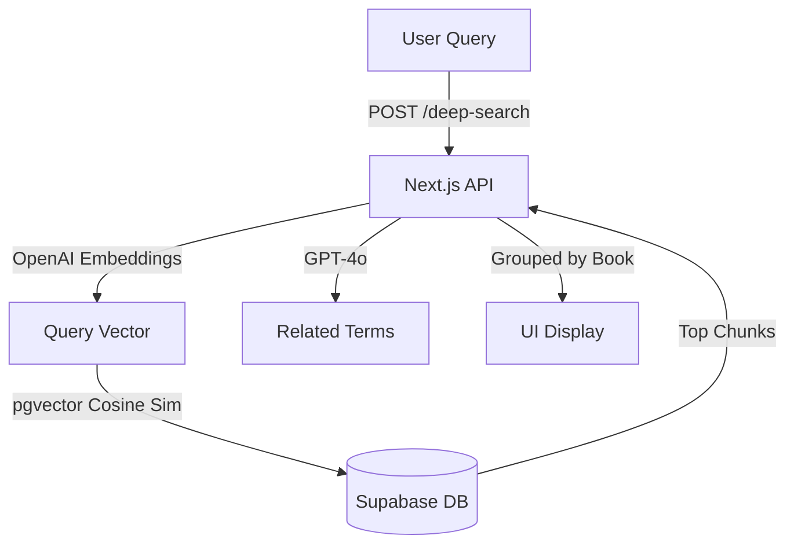

# Concept Search (Deep Search)

## Overview

**Concept Search** (also called "Deep Search") is an advanced semantic search feature that finds every book in the library discussing a specific concept, highlights the top 3 most relevant passages from each book, and provides related terms for exploration.

---

## 1. Technical Architecture

### Architecture Flow



### Components

#### Backend

- **Vector Search (`vector-search.ts`):** Uses OpenAI `text-embedding-3-small` model (1536 dimensions).
- **Deep Search Route:** Generates related terms via GPT-4o, performs vector search, and groups results.

#### Database Schema

- **`text_chunks` table:** Stores text segments with `embedding` column (`vector(1536)`).
- **`texts` table:** Stores book metadata.
- **Extension:** `pgvector` must be enabled.

### Search Algorithm

1. **Query Embedding:** Convert search query to 1536-dimensional vector.
2. **Chunk Retrieval:** Fetch up to 500 chunks from database.
3. **Similarity Calculation:** Compute cosine similarity for each chunk.
4. **Threshold Filtering:** Filter chunks with similarity ≥ 0.3.
5. **Book Grouping:** Group chunks by `text_id` and select top 3 chunks per book.

---

## 2. API Endpoints

### `POST /api/convergence/deep-search`

Performs the semantic search.

**Request:**

```json
{
  "query": "Parabrahman"
}
```

**Response:**

```json
{
  "relatedTerms": ["Advaita Vedanta", "Brahman", "Non-duality"],
  "books": [
    {
      "text_id": "uuid",
      "title": "The Secret Doctrine",
      "author": "Helena Blavatsky",
      "chunks": [
        {
          "content": "Passage text...",
          "similarity": 0.85
        }
      ]
    }
  ]
}
```

### `POST /api/convergence/generate-embeddings`

Triggers embedding generation for texts.

---

## 3. Prerequisites & Setup

1. **Environment Variables:** `OPENAI_API_KEY` is required.
2. **Database:** Postgres with `pgvector` extension.
3. **Data Processing:** Texts must be chunked and embedded using the generation endpoints.

---

## 4. Performance

- **Vector Search:** ~100-500ms depending on database size.
- **Related Terms:** ~1-2s (GPT-4o API call).
- **Scalability:** Currently limited to fetching 500 chunks; scales with pgvector indexing (IVFFlat).

---

## 5. Future Enhancements

- [ ] **Advanced Filtering:** Filter by tradition, document type, or date.
- [ ] **Hybrid Search:** Combine keyword search (FTS) with vector search.
- [ ] **Result Caching:** Cache common queries to reduce API costs.
- [ ] **Export:** Export results to CSV/Markdown.
