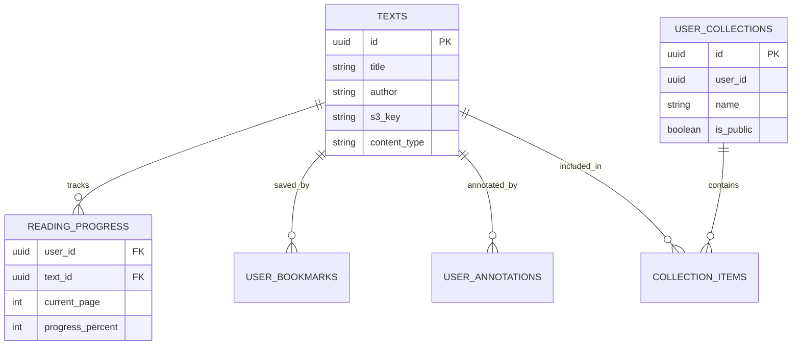

# Library Features Architecture

## Overview

This document details the technical implementation of the Library's core viewing capabilities and personalization features, including the PDF viewer, filtering system, and user-specific data (bookmarks, annotations, progress).

## Data Architecture

### Entity Relationship Diagram

## Component Architecture

### PDF Viewer System

* **Core Library**: `@react-pdf-viewer/core` & `pdfjs-dist`
* **rendering**: Client-side rendering of PDF buffers.
* **State Management**: Local state for zoom, current page; Server state (via API) for bookmarks and progress.

### Filtering System

The `AdvancedFilters.tsx` component manages complex query state.

* **State**: URL search parameters are the source of truth for sharability.
* **Debounce**: Filter changes are debounced to prevent excessive API calls.

## API & Data Flow

### Endpoints

| Endpoint | Method | Description |
|---|---|---|
| `/api/bookmarks` | `POST/DELETE` | Toggle bookmark status for a text. |
| `/api/reading-progress` | `POST` | Update reading position and time spent. |
| `/api/annotations` | `CRUD` | Manage text highlights and notes. |
| `/api/collections` | `CRUD` | Manage custom user collections. |

### Performance

* **Pagination**: Server-side pagination (default 12 items) to minimize payload.
* **PDF Loading**: Lazy loading of PDF pages to reduce initial TTI.

## Security (RLS)

* **Public Access**: `texts` table is readable by everyone (anon key).
* **Private Access**: `user_*` tables have strict RLS policies checking `auth.uid() = user_id`.
