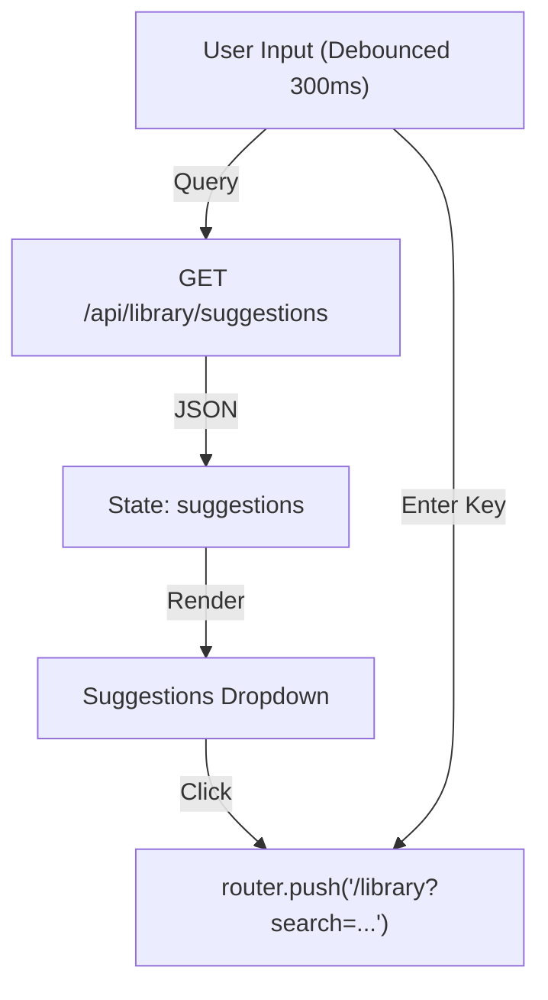

# Library Search Bar Technical Documentation

## Overview

The `LibrarySearchBar` is a client-side React component providing real-time search suggestions and navigation for the Library system. It features a debounced search input that queries the backend API for matching titles and authors.

## Visual Architecture

## Data Flow & API

### Props & State

| Prop | Type | Description |
|---|---|---|
| `onSearch` | `(query: string) => void` | Optional callback. If present, overrides default navigation. |
| `className` | `string` | Optional CSS classes for styling. |

### Data Sources

* **Endpoint**: `/api/library/suggestions`
* **Method**: `GET`
* **Query Param**: `?query=[term]`
* **Response**: `{ suggestions: [{ id, title, author }] }`

## Performance & Security

* **Rendering**: Client-Side Component (`'use client'`).
* **Performance**:
  * **Debounce**: Input is debounced by 300ms to reduce API load.
  * **Blur Delay**: `onBlur` has a 200ms delay to allow click events on suggestions to register before the dropdown closes.

## Accessibility (Dev)

* [x] **Semantic HTML**: Uses `<form>`, `<input>`, and `<button>` elements.
* [x] **Keyboard Navigation**: Submit button and suggestion items are focusable and triggerable via keyboard.
* [x] **ARIA**: `aria-label="Search Library"` present on submit button.
