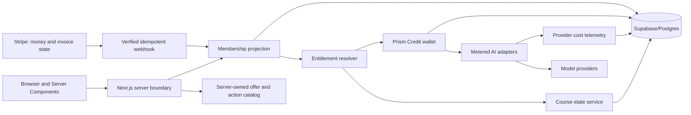

# Prismarium membership, credits, and courses: full expansion blueprint

**Date:** August 6, 2026

**Status:** Deferred expansion reference. It does not govern the immediate launch build.

**Controlling immediate plan:** [Prismarium lean membership launch plan](prismarium-lean-membership-launch-plan-2026-08-06.md)

**Live execution tracker:** [Prismarium membership implementation tracker](prismarium-membership-implementation-tracker.md)

**Parallel course board:** [Prismarium course production tracker](prismarium-course-production-tracker.md)

**Historical pricing source for this deferred blueprint (not controlling):** [Prismarium four-tier credit model](../analysis/prism-credit-four-tier-model-2026-08-05.md)

**Scope:** Membership entitlements, Prism Credits, Stripe billing, add-on packs, course previews, course concurrency, YouTube links, migration, security, customer UI, observability, verification, and rollout

> **Do not execute this blueprint as the current launch plan.** On August 6, 2026, Prismarium chose a lean monthly-only launch that defers annual billing, add-on packs, rollover, a signed-in interactive Week 1, advanced course lifecycle, and Deep Search metering. The lean plan and its 114-point tracker supersede this document for immediate work. Keep this blueprint for later expansion only when usage and revenue evidence justify the added machinery.

This document preserves the larger architecture and product possibilities evaluated before the lean launch decision. Where the August 5 analysis differs, it reflects the later full-system ideas: Student at $15/$150 as a founding offer, a future $19/$190 offer, and an interactive Week 1 preview. Those ideas are not all approved for the initial lean launch.

## Deferred full-system outcome

Build one server-authoritative membership system in which:

- Reader remains a genuinely useful free account with 10 monthly Prism Credits and the same optional credit packs as everyone else.
- Student launches at a $15 founding price, later becomes $19 for new members, and can keep one released paid course active at a time.
- Scholar is the recommended complete membership: 100 monthly credits and every released course available at once.
- Adept is the honest high-volume plan: 300 monthly credits, not a claim of unlimited AI or elevated status.
- Public YouTube courses remain an accessibility path, while Prismarium membership pays for the durable research system, sources, workbooks, saved work, course archive, and generative tools.
- People who only want tools can stay on Reader and buy credits; a course is never required.
- Every paid generation is quoted, reserved, settled, and recorded exactly once. Failed work returns the reservation.
- Student can switch courses without losing progress. A switch has an explicit confirmation but no artificial cooldown.

For historical planning context, this full system was estimated at **50–70 focused engineering days, approximately 10–14 weeks**, excluding course-video or course-content production. Its former immediate-security recommendation has been replaced by lean tracker Phase L0; do not start work from this estimate or its old phase numbers.

## 1. Deferred full-system product contract

### 1.1 Plans

| Capability | Reader | Student | Scholar | Adept |
|---|---:|---:|---:|---:|
| Monthly price | $0 | **$15 founding; $19 future standard** | **$39** | **$69** |
| Annual price | — | **$150 founding; $190 future standard** | **$390** | **$690** |
| Included Prism Credits/month | **10** | **30** | **100** | **300** |
| Included-credit rollover | None | One period; included cap 60 | One period; included cap 200 | One period; included cap 600 |
| Purchased-credit expiry | Never while the account exists, subject to final terms review | Same | Same | Same |
| Active released paid courses | 0 | **1** | No concurrency limit | No concurrency limit |
| Free introduction/taster courses | Included | Included | Included | Included |
| Public course outline and YouTube links | Included | Included | Included | Included |
| Signed-in interactive Week 1 previews | Included | Included | Included | Included |
| Full workbook, artifacts, digests, progress, and capstone | Free paths and previews | Active paid course | All released paid courses | All released paid courses |
| Completed paid-course review | — | While paid entitlement remains active | Included | Included |
| Library, ordinary search, and Knowledge Graph | Included | Included | Included | Included |
| Highlights, annotations, bookmarks, and collections | Included | Included | Included | Included |
| Active Journal pages | 50 | Unlimited | Unlimited | Unlimited |
| Saved generated-result history | Included | Included | Included | Included |
| Credit top-ups | Available | Available | Available | Available |

“No concurrency limit” applies only to released courses. No generative tier should be called unlimited. Normal safety, fraud, provider, and fair-use limits still apply to every account.

### 1.2 Add-on credit packs

| Offer code | Credits | Price | Available to |
|---|---:|---:|---|
| `credits_10` | 10 | $6 | Reader, Student, Scholar, Adept |
| `credits_30` | 30 | $16 | Reader, Student, Scholar, Adept |
| `credits_75` | 75 | $36 | Reader, Student, Scholar, Adept |

There is no separate Reader boost. A Reader uses these same packs. Purchased credits are spent after expiring included credits.

### 1.3 Credit costs

| Server action code | Customer action | Credits | Launch state |
|---|---|---:|---|
| `working.generate` | The Working | 1 | Enabled after response/persistence repair |
| `seven_lenses.expand` | Expand one lens | 1 | Enabled after wallet integration |
| `seven_lenses.standard` | Standard Seven Lenses synthesis | 2 | Enabled after wallet integration |
| `seven_lenses.long` | Long Seven Lenses synthesis | 3 | Enabled after wallet integration |
| `deep_search.fresh` | Fresh Deep Search synthesis | 3 | Enabled after wallet and cache repair |
| `deep_search.cached_exact` | Exact cached Deep Search result | 0 | Enabled and visibly labelled cached |
| — | Library, ordinary search, Graph, Journal, saved-result reopen | 0 | Always outside the wallet |
| `image.generate` | Future card/image generation | 5 provisional | **Disabled and not marketed at launch** |

The server derives the action code and cost from the requested operation. A browser can never submit its own credit price. Automatic infrastructure retries remain part of the original reservation. A customer-requested regeneration is a new action.

### 1.4 Course preview contract

| Visitor state | What is available |
|---|---|
| Anonymous | Core question, outcomes, expected workload, complete weekly outline, public reading list, capstone description, and available YouTube episodes/playlist |
| Signed-in account, any tier | Everything above plus one complete interactive Week 1, one complete Reader’s Digest where available, reading-depth choices, workbook prompt/save, Library and Graph links, and normally priced tool links |
| Student after activation | Every week, the complete workbook and artifacts, progress, capstone, and course community for the one active course |
| Scholar/Adept after activation | The same full experience across any number of released courses |

The signed-in preview creates no paid enrollment and consumes no course slot. Preview work is saved to the Journal with course/week metadata so it carries forward after activation. Tool use inside a preview uses the account’s normal Prism Credits; the preview does not create a second hidden allowance.

### 1.5 Course rules

- A Student has one **active guided paid course**, not one lifetime choice and not one browser tab.
- Free introduction/taster courses never consume the paid slot.
- Activating another paid course atomically pauses the current one after confirmation.
- Pausing preserves progress, Journal entries, artifacts, annotations, contributions, and Week 1 preview access. It removes locked-week access until reactivation.
- A completed course consumes no active slot and remains reviewable while the member retains paid course entitlement.
- Scholar and Adept may have multiple active released courses.
- Credits cannot buy a course slot.
- A Scholar/Adept downgrade to Student asks which course should remain active. If no choice is recorded before the effective date, the most recently active course remains and the rest pause.
- A downgrade to Reader pauses paid courses at the effective date; no work is deleted.
- Student course switching has no monthly limit or cooldown. Abuse prevention belongs on expensive generation, not on ordinary learning choices.

### 1.6 Content and accessibility policy

- Courses are always optional. The dashboard must present courses and independent tools as parallel paths.
- Prismarium may publish full core course videos on YouTube and link them permanently from the course page.
- The safe public promise is that Prismarium offers substantial free public videos and resources. Do not promise that every future video, studio note, or creator format will always be free.
- Membership value must remain defensible during months with no new YouTube upload.
- A course may suggest at most one generative action per week unless it grants bonus credits.
- Every generative course practice must include a zero-credit manual, Library, ordinary Search, or Graph alternative.
- If AI ever becomes mandatory for completion, the course must grant the required credits; it cannot force an upgrade.
- Early previews, studio notes, or creator material can be bonuses, but no tier promises a publishing cadence.

### 1.7 Founding-price rule

- The founding Student offer is $15/month or $150/year.
- The future standard offer is $19/month or $190/year for new purchases only.
- Founding eligibility remains attached to the member while paid membership is continuous, including Student monthly/annual changes and a temporary upgrade to Scholar or Adept.
- `cancel_at_period_end` does not remove eligibility until paid access actually ends. A terminal lapse or cancellation after the access end removes it.
- At cutover, remove founding offers from the server’s new-checkout allowlist. Never delete their Stripe Prices; existing subscriptions continue renewing on them.
- Any current Scholar/Adept subscriber on an older live price should keep that exact price as a hidden legacy cohort while continuously subscribed. It is not advertised to new customers.

The $19 cutover is a business decision, not an automatic timer. Make it a server-controlled offer flag and evaluate it after 60–90 days of stable billing data, meaningful Student use, acceptable support load, and healthy retention/cost signals.

## 2. Historical full-system implementation audit

### 2.1 Reusable foundations

- The application is already on Next.js 16, React 19, Stripe’s server SDK, Supabase, Zod, React Query, Sentry, and Playwright.
- Stripe Checkout, a customer-portal redirect, webhook signature verification, and a subscription sync route already exist.
- Public course responses are sanitized on the server in [`courses/access.ts`](../../app/src/lib/courses/access.ts), and full-course JSON is already requested separately.
- Course detail, catalog, learner, Journal, Reading Digest, community, Library, Graph, Seven Lenses, Deep Search, and The Working surfaces exist.
- The Journal API already contains a 50-active-page Reader check and expects course/workbook metadata.
- A YouTube-backed `videos` schema and community video surfaces exist, although their migrations are outside the canonical migration folder.
- The codebase already uses Route Handlers for the JSON/SSE/external integration boundaries that membership work needs.

### 2.2 Gaps identified for the deferred full system

| Severity | Behavior observed at the time | Why it mattered to the former full-system launch |
|---|---|---|
| Critical | Authenticated users have broad `users` update privileges and an own-row update policy in [`remote_schema.sql`](../../supabase/migrations/20260219210102_remote_schema.sql) | A customer can potentially alter role, subscription state, Stripe identifiers, or `tokens_earned`. Billing state cannot be trusted. |
| Critical | `course_enrollments` is directly insertable, updateable, and deleteable by its owner | A browser can bypass any API-only Student slot rule. |
| Critical | The Stripe webhook uses the cookie/session Supabase client and ignores mutation errors in [`webhook/route.ts`](../../app/src/app/api/stripe/webhook/route.ts) | An unauthenticated webhook can silently fail under RLS while still returning success. |
| Critical | Checkout accepts a client-provided raw `priceId` and arbitrary `mode` in [`create-checkout-session/route.ts`](../../app/src/app/api/stripe/create-checkout-session/route.ts) | It is not a server allowlist and cannot safely sell packs or new plan versions. |
| Critical | Unknown Stripe Prices default to Scholar | A catalog/configuration error grants the wrong entitlement instead of failing closed. |
| High | Existing paid users are sent through new-subscription Checkout for “upgrade” and “downgrade” | This can create duplicate subscriptions and does not model proration, scheduled downgrades, or founding eligibility. |
| High | There is no webhook event inbox/idempotency table | Duplicate or out-of-order Stripe events can grant access or credits more than once. |
| High | Current Parallax limits are 1 lifetime / 5 / 25 / 50 queries and fail open on database error in [`rate-limit.ts`](../../app/src/lib/parallax/rate-limit.ts) | This is not the approved wallet and is bypassable/inconsistent. |
| High | Fresh Deep Search checks a quota but never records the query; expanded lenses and The Working are not wallet-metered | Customer-visible allowances cannot be enforced consistently. |
| High | Authenticated users can insert global Deep Search cache entries | A user can poison a zero-credit shared result cache. |
| High | The current DALL-E tarot endpoint is authenticated but unmetered | A costly image route remains a bypass; it must be disabled until the five-credit action is re-costed and implemented. |
| High | Enrollment existence—not active/paused state—unlocks a full course | Student concurrency would be cosmetic rather than real. |
| High | No application mutation reliably advances course week or persists explicit completion | Completed-course review and slot release cannot be trusted yet. |
| High | There are three migration directories: `supabase/migrations`, repository-root `migrations`, and `app/src/lib/supabase/migrations` | The CLI treats `supabase/migrations` as canonical; the repository cannot presently prove deployed schema from source. |
| Medium | `api_usage` permits the app’s `parallax_query` type while the database constraint allows `convergence_query`, and usage writes use a session client | Cost telemetry is incomplete or silently rejected. |
| Medium | Pricing is hardcoded inside [`SubscriptionTab.tsx`](../../app/src/components/SubscriptionTab.tsx), and no public `/pricing` page or wallet exists | Public and account copy will drift unless they share one catalog. |
| Medium | The current course `preview` renderer prop is a parser-debug label, not a secure learner preview | Week 1 must have a distinct server response and interaction mode. |

These are sequencing facts, not reasons to abandon the model. The existing product surfaces can remain; their authorization and accounting boundaries need to be replaced underneath them.

## 3. Target architecture



### 3.1 Sources of truth

- **Stripe** is authoritative for money, paid invoices, refunds, disputes, and the raw subscription object.
- **Postgres `billing_memberships`** is the application projection used to resolve access without calling Stripe on every request.
- **Postgres credit grants, reservations, allocations, and transactions** are authoritative for Prism Credits.
- **Postgres enrollment status and week progress** are authoritative for course access.
- **A server-only catalog** maps safe offer/action codes to exact Stripe Prices, dollar amounts, intervals, entitlements, and credit costs.
- `users.subscription_status` remains a temporary read-only compatibility projection during migration, then is removed from entitlement decisions.
- `users.tokens_earned` is never reused as money or Prism Credits. Rename/deprecate it as community points separately if desired.

### 3.2 Boundary rules

- The browser sends an offer code or requested operation, never a Stripe Price ID, dollar amount, credit amount, plan entitlement, or wallet balance.
- Financial, wallet, and enrollment mutations pass through authenticated server code and atomic Postgres functions.
- Route Handlers remain the right boundary for Stripe webhooks, Checkout, JSON APIs, and Seven Lenses SSE. Server Components should perform new internal page reads where practical.
- The service-role client is imported only from server-only modules. Customer identity always comes from a separately verified Supabase session before a service-role mutation receives a `user_id`.
- Prefer database functions running as the service role with `SECURITY INVOKER`. If a narrowly scoped `SECURITY DEFINER` function is genuinely required, it must use fully qualified relation names, a fixed/empty `search_path`, and execution revoked from `public`, `anon`, and `authenticated`.
- Locked course JSON is never returned and hidden in React. The server returns a purpose-built public outline, signed-in Week 1 payload, or full entitled payload.

## 4. Target application modules

| Module | Responsibility | Proposed files |
|---|---|---|
| Shared membership contracts | Plan codes, intervals, statuses, structured errors, safe response types | `app/src/lib/membership/types.ts`, `app/src/lib/billing/contracts.ts`, `app/src/lib/credits/contracts.ts`, `app/src/lib/courses/contracts.ts` |
| Public product catalog | Ordered plan feature copy and safe action labels reused by pricing/account/tool UI | `app/src/lib/membership/catalog.ts`, `app/src/lib/credits/action-catalog.ts` |
| Server billing catalog | Exact Stripe Price allowlist, live/test validation, founding selection | `app/src/lib/billing/stripe-catalog.server.ts` |
| Stripe client | One pinned client, bounded retries, request idempotency | `app/src/lib/billing/stripe.server.ts` |
| Entitlement resolver | Resolve plan, access state, credit allowance, course limit, admin test override | `app/src/lib/membership/entitlements.server.ts` |
| Billing service | Checkout, plan changes, Stripe projection, fulfillment and reconciliation | `app/src/lib/billing/service.server.ts`, `webhook.server.ts` |
| Credit wallet | Quote, ensure grant, reserve, commit, release, history, refund/reversal | `app/src/lib/credits/wallet.server.ts` |
| AI metering adapter | Wrap each provider action with a reservation and telemetry | `app/src/lib/credits/with-credit-reservation.server.ts` |
| Course access service | Public/preview/full payload, activation, pause, completion, downgrade effects | `app/src/lib/courses/entitlements.server.ts`, `enrollment.server.ts` |
| Customer state APIs | Safe summary, wallet, transactions, Checkout, plan change | `app/src/app/api/billing/*`, `app/src/app/api/credits/*` |
| Operations | Reconciliation, failed event retry, adjustments, anomaly holds | `app/src/app/api/internal/billing/*`, `app/src/app/admin/billing/*` |

The safe public plan catalog and the server Stripe catalog must be separate: marketing copy can be sent to the browser; Stripe identifiers and offer-selection rules cannot.

## 5. Database and migration design

### 5.1 Canonical migration sequence

Use only `supabase/migrations/` for new migrations. Do not simply move historical files that may already have been applied manually. First compare linked migration history and live schema, then add forward-only reconciliation migrations.

Recommended sequence:

1. `20260806000100_reconcile_schema_and_harden_permissions.sql`
2. `20260806000200_add_billing_memberships_and_events.sql`
3. `20260806000300_add_prism_credit_ledger.sql`
4. `20260806000400_add_course_access_lifecycle.sql`
5. `20260806000500_add_course_preview_and_video_links.sql`
6. `20260806000600_backfill_memberships_credits_and_enrollments.sql`

Every migration must be additive, wrapped in a transaction where supported, repeatable in a fresh local database, and accompanied by permission/invariant tests.

### 5.2 Security reconciliation

The first migration must:

- Revoke broad `ALL` and `UPDATE` privileges on `users` from `anon` and `authenticated`.
- Replace own-row `users` update with explicit safe columns only, or move preferences such as TTS into a dedicated user-preferences table.
- Keep role, billing state, Stripe identifiers, dates, and any wallet-related columns service-only.
- Revoke direct insert/update/delete on `course_enrollments`; retain safe own-row select.
- Make global Deep Search cache writes service-only and include a cache-version key.
- Make `api_usage`/new `ai_usage_events` inserts service-only.
- Add unique constraints to Stripe customer/subscription identifiers after deduplicating live data.
- Reconcile the Journal course columns, workings tables, videos tables, and community tables currently represented only under `app/src/lib/supabase/migrations`.
- Add `server-only` protection to the service client and audit every import.

### 5.3 Billing tables

#### `billing_memberships`

One row per user:

- `user_id` primary key.
- `plan_code`: `reader | student | scholar | adept`.
- `stripe_status`: the complete Stripe state, separate from plan.
- unique nullable `stripe_customer_id` and `stripe_subscription_id`.
- `price_key`, `billing_interval`, `pricing_cohort` (`standard | founding | legacy`).
- `current_period_start`, `current_period_end`, `cancel_at_period_end`, `access_until`.
- `credit_anchor_at`, `current_credit_period_start`, `current_credit_period_end`.
- `founding_lost_at`, `billing_hold`, `grace_until`.
- `last_stripe_object_created_at`, `last_event_id`, `created_at`, `updated_at`.

Plan and payment state are deliberately separate. `past_due Student` is still a Student plan with a delinquent payment state; policy decides whether temporary grace applies.

#### `billing_offer_windows`

- Catalog version and offer code.
- `enabled_for_new_sales`, optional start/end, optional capacity cap.
- Admin/service write only.
- Allows the founding-to-standard cutover without a redeploy or deleting Stripe Prices.

#### `billing_checkout_intents`

- User, safe offer code, request UUID/idempotency key, Checkout Session ID, mode, state, expiration, Stripe PaymentIntent/invoice references.
- Unique `(user_id, request_id)` prevents double-click duplicate Checkout.

#### `billing_webhook_events`

- Unique Stripe event ID, event type, object ID/type, `livemode`, Stripe-created time.
- `processing | processed | failed | quarantined`, attempts, last error, timestamps.
- A retry may reclaim a failed event; a processed event is a no-op.

#### `billing_plan_changes`

- Current and target plan/interval/price key, effective date, status.
- Proration/Stripe pending-update reference.
- `retained_course_id` for a future Student downgrade.
- Audit data for founding eligibility impact.

### 5.4 Credit tables

#### `credit_accounts`

- `user_id` primary key.
- Cached `available_credits`, `reserved_credits`, `debt_credits`, lifetime granted/spent/purchased.
- `version`, `locked_at`, `lock_reason`, timestamps.
- Available balance has a database check preventing negative values. Dispute debt is recorded separately and blocks generation.

#### `credit_grants`

- User, kind (`reader_monthly`, `subscription_monthly`, `upgrade_delta`, `purchase`, `course_bonus`, `admin_adjustment`, `reinstatement`).
- Original and remaining amount.
- Unique source key such as `reader:USER:2026-08`, `subscription:USER:CREDIT_PERIOD`, or `checkout:SESSION_ID`.
- `valid_from`, nullable `expires_at`, state, Stripe/source references, metadata.
- Paid included grants expire after the immediately following credit period; purchased grants have no expiry.

#### `credit_reservations`

- User-scoped idempotency key and request fingerprint.
- Server-derived action code and quoted credit cost.
- `pending | committed | released | expired`, result reference, expiry, settlement timestamps.
- Provider/model/cost fields live in usage telemetry, not trusted client metadata.

#### `credit_reservation_allocations`

- Maps a reservation to one or more grants.
- Reservation consumes earliest-expiring included grants first, then purchased grants.
- Release restores the exact allocations once.

#### `credit_transactions`

- Append-only events: grant, reserve, commit, release, expire, purchase, reversal, refund, dispute, debt recovery, admin adjustment.
- Signed amount, balance snapshot, grant/reservation/external reference, reason and actor.
- No updates or deletes. Corrections use compensating entries.

#### `credit_purchases` and `credit_debts`

- `credit_purchases` records the Checkout Session, PaymentIntent/Charge, safe pack code, amount/currency, fulfillment state, receipt URL, cumulative refund, and unique fulfillment grant.
- `credit_debts` records credits already spent when a purchase is later refunded or disputed. Debt offsets future grants while customer-visible spendable balance remains zero; it never rewrites prior transactions or makes `available_credits` negative.
- Full-pack refunds are the initial self-service policy. Any external partial refund uses one deterministic proportional formula and an append-only reversal.

#### `ai_usage_events`

- Reservation/request/user/action/plan/cohort.
- Provider, exact model/fallback, provider request ID, actual input/output/image units.
- Cache hit, latency, result state, error class, cost-rate version, estimated actual COGS.
- Do not copy full private prompts into billing telemetry. Store user content only in its user-owned result record.

### 5.5 Course tables and columns

#### `courses`

Add explicit fields instead of inferring business rules from slugs or JSON:

- `access_tier`: `free | paid`.
- `availability_status`: `preview | released | retired`.
- `preview_week_count`: launch default `1`.
- `released_at` and optional `retired_at`.

Keep editorial “current/coming next” presentation separate from whether an already released course remains available in the archive.

#### `course_enrollments`

Add:

- `status`: `active | paused | completed`.
- `activated_at`, `paused_at`, `last_activity_at`.
- Retain `completed_at`, `current_week`, existing `progress`, and all historical work.
- Unique `(user_id, course_id)` for course enrollments.

The enrollment status is the single source for active-course state. Do not duplicate a Student’s active course in `billing_memberships`; the atomic activation function locks the membership and relevant enrollments together.

#### `course_week_progress`

- Unique `(enrollment_id, week_number)`.
- `not_started | in_progress | completed`, current learner stage, timestamps.
- Course completion is an explicit mutation after the final week, not an inference from merely opening the last week.

#### `journal_pages`

Reconcile the already-used `course_id`, `week_number`, `entry_type`, `artifact_name`, `tags`, `is_pinned`, and `working_id` columns into the canonical migration chain. Preview workbook saves use these fields, so activation requires no data copy.

#### `course_videos`

Link existing `videos` rows to courses:

- `course_id`, `video_id`, optional `week_number`, relation type (`episode | supplemental | orientation`), sort order.
- Public visibility by default for the core YouTube course series.
- Course API returns only validated `youtube.com`/`youtu.be` destinations and safe metadata.

### 5.6 Atomic database operations

Implement service-only SQL functions with concurrency tests:

- `ensure_current_credit_period(user_id, now)` — create only the current Reader or paid grant, expire stale grants, never backfill an expired stockpile.
- `reserve_credits(user_id, action_code, cost, idempotency_key, request_fingerprint)` — lock account/grants, allocate FIFO, reject insufficient balance, never overspend.
- `commit_credit_reservation(reservation_id, result_ref)` — settle once.
- `release_credit_reservation(reservation_id, reason)` — restore exact allocations once.
- `reconcile_stale_credit_reservations(now)` — release abandoned pending work; also run just-in-time before a new reservation.
- `activate_course(user_id, course_id, confirmed_replace_course_id)` — lock membership/enrollments, verify released access, atomically pause/activate under the tier limit.
- `record_course_week_progress(user_id, course_id, week, stage/status)` — enforce entitled course state and advance safely.
- `complete_course(user_id, course_id)` — verify completion rules, mark completed, free the Student slot.
- `apply_effective_plan_change(user_id, target_plan, retained_course_id)` — enforce downgrade course effects even when the change originated outside the app.

## 6. Server APIs and response contracts

| Endpoint | Purpose | Important contract |
|---|---|---|
| `GET /api/billing/me` | Membership, renewal, founding, pending change, course limit, wallet summary | Safe customer projection; no raw Stripe IDs |
| `POST /api/billing/checkout` | New subscription or pack Checkout | Body `{ offerCode, requestId }`; reject raw Price/mode/amount/credit fields |
| `POST /api/billing/change-plan` | Preview/confirm paid plan change | Prevent second subscription; return exact effective date, proration, founding and course impact |
| `POST /api/billing/portal` | Payment methods, invoices, cancellation/reactivation | Do not expose unmanaged plan switching in v1 |
| `POST /api/billing/reconcile` | Authenticated recovery after delayed webhook | Retrieve only the caller’s known customer/subscription/session; no global recent-session scan or email guessing |
| `GET /api/credits` | Balance and expiry breakdown | Total, included, purchased, reserved, debt, next grant, expiring amount |
| `GET /api/credits/transactions` | Cursor-paginated history | Customer-safe event labels and receipt/refund link where available |
| `GET /api/courses/[id]` | Anonymous public outline | Never includes protected prompts/exercises |
| `GET /api/courses/[id]?access=preview` | Signed-in full Week 1 preview | Explicit allowlist for exactly the approved preview weeks |
| `GET /api/courses/[id]?access=full` | Active/completed entitled course | Paused Student enrollment returns `COURSE_PAUSED` |
| `POST /api/courses/[id]/activate` | Activate or atomically switch | `409 COURSE_SLOT_FULL` returns current course until explicit confirmation |
| `POST /api/courses/[id]/pause` | Optional organization/pause | Preserves all work |
| `POST /api/courses/[id]/complete` | Explicit completion | Frees Student slot and preserves review access while entitled |

Use structured errors consistently: `AUTH_REQUIRED`, `EMAIL_VERIFICATION_REQUIRED`, `UPGRADE_REQUIRED`, `INSUFFICIENT_CREDITS`, `BILLING_HOLD`, `COURSE_SLOT_FULL`, `COURSE_PAUSED`, `COURSE_NOT_RELEASED`, and `FEATURE_DISABLED`.

## 7. Stripe implementation

### 7.1 Server-owned offer catalog

| Offer code | Mode | Exact amount | Entitlement/fulfillment |
|---|---|---:|---|
| `student_founding_monthly` | subscription/month | $15 | Student + 30 monthly credits |
| `student_founding_annual` | subscription/year | $150 | Student + 30 credits each month |
| `student_standard_monthly` | subscription/month | $19 | Student + 30 monthly credits |
| `student_standard_annual` | subscription/year | $190 | Student + 30 credits each month |
| `scholar_monthly` | subscription/month | $39 | Scholar + 100 monthly credits |
| `scholar_annual` | subscription/year | $390 | Scholar + 100 credits each month |
| `adept_monthly` | subscription/month | $69 | Adept + 300 monthly credits |
| `adept_annual` | subscription/year | $690 | Adept + 300 credits each month |
| `credits_10` | payment | $6 | 10 non-expiring purchased credits |
| `credits_30` | payment | $16 | 30 non-expiring purchased credits |
| `credits_75` | payment | $36 | 75 non-expiring purchased credits |

Create immutable Stripe Prices and use server-only environment names such as `STRIPE_PRICE_STUDENT_FOUNDING_MONTHLY`; remove `NEXT_PUBLIC_` from price identifiers. Extend `verify-stripe-prices.ts` to validate Price ID, product, amount, currency, active state, recurring interval, mode, and live/test environment for all eleven offers.

### 7.2 Checkout rules

- Reader → paid uses subscription Checkout.
- A current paid subscriber never starts another subscription Checkout. Use the custom change-plan flow.
- Pack Checkout is available to every verified account and always has fixed quantity one.
- Resolve founding eligibility on the server; do not infer it from `plan === student` in React.
- Use Stripe idempotency keys plus `billing_checkout_intents` for double-click/network retry safety.
- Set `client_reference_id` and server-owned metadata on Session and Subscription/PaymentIntent.
- Validate the configured Stripe Price object at startup/verification and fail closed on any mismatch.
- Prefer letting Checkout create the Customer on a completed first purchase rather than creating abandoned Customers before payment.
- Include `{CHECKOUT_SESSION_ID}` in the success URL. The return page may call the same idempotent server fulfillment/reconciliation function for responsiveness, but it never trusts the redirect or mutates a wallet from the browser.

### 7.3 Webhook rules

- Keep raw-body signature verification.
- Use the server-only service client after verification.
- Insert/claim the Stripe event before processing and make every downstream source key unique.
- Do not assume delivery order. Compare Stripe object/event timestamps before overwriting newer state.
- Check every database result. Return a retryable failure on transient processing error.
- Unknown Price IDs are quarantined and alerted; never mapped to a default tier.

| Stripe event | Application behavior |
|---|---|
| `checkout.session.completed` | Save association; fulfill a pack only if paid; link subscription Checkout but wait for a verified paid invoice before granting the paid period |
| `checkout.session.async_payment_succeeded/failed`, `checkout.session.expired` | Fulfill delayed pack once or mark failed/expired with no grant |
| `invoice.paid` | Activate/sync paid entitlement and ensure the current monthly credit subperiod once |
| `invoice.payment_failed` / action required | Mark delinquent, notify, grant nothing new |
| `customer.subscription.updated` | Sync plan, payment state, cancellation schedule, and pending change; apply an upgrade only after the required invoice succeeded |
| `customer.subscription.deleted` | End paid entitlement, expire included paid credits, pause inaccessible courses, preserve work/purchased credits, mark founding lapse |
| Refund events | Compensating ledger reversal tied to the original pack/invoice |
| Dispute events | Billing hold, deterministic reversal/debt, manual review; reinstatement is another compensating entry |

Recommended delinquency policy: retain course access for a seven-day `past_due` grace period, issue no new included grant, and fall back to Reader on terminal `unpaid`/canceled state. Finalize this and refund language in Terms before launch.

### 7.4 Plan changes

- Upgrades can be immediate after successful prorated invoice payment. Grant only the current-period allowance difference: Student→Scholar +70, Scholar→Adept +200, Student→Adept +270.
- Downgrades take effect at renewal and do not claw back the current period’s credits.
- Monthly↔annual changes occur at the period boundary in v1; this avoids mixed proration and annual monthly-grant edge cases.
- The plan-change confirmation shows price, effective date, proration, founding eligibility effect, credit allowance, and courses that will pause.
- Configure Stripe’s portal for payment method, invoices, cancellation, and reactivation. Keep portal plan switching off until it can enforce these exact same rules.

## 8. Prism Credit implementation

### 8.1 Monthly grants

- Reader receives 10 after verified sign-in, once per UTC calendar month. The grant expires at the next UTC month boundary and never exceeds 10 included credits.
- Paid members have a monthly credit anchor even on annual billing.
- A paid grant expires at the end of the following credit period, naturally producing the 2× included cap.
- `ensure_current_credit_period` runs before balance reads and reservations. An idempotent scheduled reconciliation may run as backup for annual members and operations, but just-in-time granting keeps the wallet correct without depending exclusively on a job.
- An outage never backfills a pile of already expired grants.
- Paid cancellation expires remaining paid included credits when paid access ends. The current Reader period can then be ensured. Purchased credits stay.

### 8.2 Reservation sequence

1. Authenticate and require a verified account.
2. Validate input, action type, response length, feature flag, request fingerprint, and safety limits.
3. For Deep Search, check the exact versioned cache first. A hit costs zero and is still logged/rate-limited.
4. Ensure the current grant and release any stale reservation for that request/user.
5. Atomically reserve server-quoted credits from earliest-expiring included grants, then purchased grants.
6. Run the provider under request, output, timeout, retry, and concurrency caps.
7. Persist a usable user-owned result.
8. Commit the reservation once and return the authoritative wallet summary.
9. On timeout, provider error, moderation failure, empty/unusable output, or failed persistence, release once and tell the UI the credits returned.

For Seven Lenses SSE, reserve before the stream, save/commit before the terminal `done` event, release in the error path, and reconcile abandoned pending reservations. The client never decrements its own balance.

### 8.3 Endpoint integration

| Surface | Existing path | Required change |
|---|---|---|
| Seven Lenses initial synthesis | `api/parallax/query` and `lib/parallax/streaming.ts` | Replace legacy query check/record with 2/3-credit reservation; persist result before settle |
| Expanded lens | `api/parallax/lens/[lensId]` | Add 1-credit reservation and actual provider/model telemetry |
| Deep Search | `api/parallax/ai-search` | Make cache service-written/versioned; cached exact 0, fresh usable AI result 3, retrieval-only fallback 0 |
| The Working | `api/working/generate` | Resolve palette first, reserve 1 before provider generation, persist to `workings`, settle only on usable saved result |
| Tarot/image generation | `api/practitioner/tarot/generate` | Disable in production until storage/persistence, actual COGS, safety, and provisional 5-credit flow pass launch review |
| Generic Claude/GPT/Gemini routes | `api/ai/*` | Remove, production-disable, or admin-gate so they cannot bypass the wallet |

### 8.4 Abuse controls independent of credits

- Verified email before Reader grant or generation.
- Adaptive CAPTCHA/Turnstile and account/IP velocity checks while avoiding blanket disposable-email bans that harm accessibility.
- One provider generation concurrently per account at launch.
- Atomic account and privacy-preserving hashed-IP burst limits.
- Prompt/query length, active-lens, retrieval-context, output, duration, and provider-retry caps.
- Cached zero-credit responses remain rate-limited.
- Global daily provider-cost circuit breaker, per-action kill switch, and per-account anomaly hold.
- Stripe Radar/3DS for payment fraud; checkout/session velocity limits remain application responsibilities.
- Admins are not exempt from provider telemetry or safety caps in production.

## 9. Course lifecycle, preview, and YouTube implementation

### 9.1 Access state machine

| Existing state | Requested action | Result |
|---|---|---|
| No enrollment, paid course, Reader | Activate | `UPGRADE_REQUIRED`; preview remains available |
| No enrollment, paid course, Student with empty slot | Activate | Create/mark target active |
| No enrollment or paused target, Student with another active course | Activate | Return `COURSE_SLOT_FULL` and current course; after confirmation atomically pause current and activate target |
| No enrollment or paused target, Scholar/Adept | Activate | Create/mark target active; other courses unchanged |
| Active | Pause | Paused; work remains; locked-week payload becomes unavailable |
| Paused | Reactivate | Apply the same tier/course-limit rules as activation |
| Active final course state | Complete | Explicitly mark completed; no longer counts toward Student slot |
| Completed, paid entitlement active | Review | Full read access; no slot consumed |
| Completed/paused, paid entitlement ended | Review | Public outline + signed-in Week 1 only; work remains in Journal and returns on resubscription |

Every transition is authorized by the central entitlement resolver and executed atomically in Postgres. Course catalog links must use authoritative access/status fields, not `!!enrollment`.

### 9.2 Public versus signed-in payloads

Keep three explicit serializers:

1. `serializePublicCourseOutline` — all weekly titles/summaries and safe reading references, no protected exercises/prompts/digests.
2. `serializeInteractiveCoursePreview` — public outline plus the complete approved Week 1 content and one live digest; requires a signed-in owner.
3. `serializeFullCourse` — complete enriched curriculum; requires active/completed entitlement or admin.

The course route can retrieve full source data with the service client internally, but tests must inspect the actual network JSON and prove the serializer never leaks later-week protected material. Do not rely on a React component to conceal it.

### 9.3 Preview experience

Create a real learner mode rather than reusing `CourseLearnerRenderer`’s parser-debug `preview` flag:

- Extract the reusable Week view/stages into a component with `mode: preview | full`.
- Anonymous visitors see the public outline and a sign-in invitation for the interactive Week 1.
- Signed-in preview supports local navigation, reading-depth choices, one digest, workbook save, and links to zero-credit Library/Graph or clearly priced AI actions.
- A preview save writes a course-tagged Journal entry, not a `course_enrollments` row.
- Do not write course completion, community contribution, or full-course reading progress from preview mode.
- End with a tier-aware CTA:
  - Reader: “Join Student to continue this guided path.”
  - Student with open slot: “Activate this course.”
  - Student with occupied slot: “Switch active course.”
  - Scholar/Adept: “Start the full course.”
- Saved Week 1 Journal work appears automatically after activation.

### 9.4 YouTube integration

- Reconcile the existing `videos` migration into the canonical chain and add `course_videos` rather than embedding arbitrary URLs throughout course JSON.
- Add course-video assignment to the admin course editor, with week and sort-order selection.
- Reuse/centralize the safe YouTube URL validation already present in `courses/launch-presentation.ts`.
- Course detail and catalog expose “Watch free on YouTube” independently of sign-in or membership.
- Do not autoplay. Surface captions/transcript availability where YouTube metadata provides it.
- External links use safe new-tab attributes and accessible text announcing that behavior.
- Current whole-card course links must become semantic `<article>` containers before adding a second nested YouTube link; nested anchors are invalid and inaccessible.

### 9.5 Course-work governance

Extend the course parser/validator so every generative practice declares:

- `credit_action_code` and displayed cost.
- `manual_alternative` or another zero-credit path.
- Whether it is optional or required.
- Optional `course_bonus_credits`; leave zero at launch unless a future course truly requires generation.

Fail course publication validation if a required generative action has no funded allowance or zero-credit alternative. This is much simpler and more honest than a hidden “course-aware tool access” bypass.

### 9.6 Completion records, deliberately after launch

Do not use a vague “e-certificate” to justify the initial price. First make progress and completion truthful. After at least one course has reliable week/completion state, an optional later phase can issue a **Prismarium Record of Completion**:

- Included at no credit charge for every paid tier that completes a course.
- Clearly not accredited, licensed, or a professional certification.
- Course title, completion date, completed weeks/artifacts, unique verification ID, and shareable verification page.
- Revocable/reissuable if data is corrected.

This is a post-launch trust feature, not a launch blocker or an Adept distinction.

## 10. Customer-facing implementation

### 10.1 Shared client contracts and state

Create shared types and React Query hooks:

- `useBillingSummary`
- `useCreditWallet`
- `useCourseActivation`

The existing React Query provider can hydrate/update these states. Mutations invalidate or replace responses with the server-returned authoritative summary. No optimistic local credit deductions or course-status inventions.

### 10.2 Public pricing

Create:

- `app/src/app/pricing/page.tsx`
- `app/src/components/pricing/PricingGrid.tsx`
- `PlanCard.tsx`
- `PlanChangeDialog.tsx`

Requirements:

- Render Reader → Student → Scholar → Adept from the shared safe catalog.
- Scholar is visually recommended; Adept is described as high-volume capacity.
- Monthly/annual toggle shows the ten-month annual price transparently.
- Student copy states “$15/month founding rate; future standard price $19/month” without fake countdowns or a misleading sale strikethrough.
- Courses are described as optional for Scholar/Adept.
- Reader clearly includes 10 monthly credits and the same purchasable packs.
- Explain that core Library/Graph/Journal/saved results do not cost credits.
- Explain that the full public video series can be watched on YouTube while membership adds the interactive study environment.
- Add `/pricing` to public routing. Add only a concise homepage CTA after the full pricing page and entitlements are ready; do not publish the full table early.

### 10.3 Account billing

Refactor `SubscriptionTab.tsx` into an account-billing surface backed by `GET /api/billing/me`:

- Current plan, exact paid price, interval, founding/legacy status, renewal/cancellation date.
- Pending plan change and its effective date.
- Manage-payment/invoice/cancellation link to Stripe Portal.
- App-managed plan change dialog for upgrade/downgrade.
- Course-impact selector for a future Student downgrade.
- Remove the existing manual auto-sync heuristics and global Checkout-session scan.
- Never send a paid user to new-subscription Checkout.

### 10.4 Wallet

Create:

- `app/src/app/wallet/page.tsx`
- `CreditBalanceButton.tsx`
- `CreditBalanceCard.tsx`
- `CreditPackGrid.tsx`
- `CreditTransactionList.tsx`
- `InsufficientCreditsDialog.tsx`

Wallet requirements:

- Global compact balance link in desktop/mobile header menus.
- Total available, included, purchased, reserved, expiring amount/date, next grant, and billing hold/debt if applicable.
- Pack catalog visible to Reader and paid tiers at identical prices.
- Checkout state remains “Processing payment” until the idempotent server projection/fulfillment confirms it.
- Cursor-paginated events with human labels: monthly grant, generation, released reservation, purchase, expiry, refund, dispute, adjustment.
- Receipt link for Stripe purchase where available.
- A failed generation says “No credits used” or “N credits returned.”
- A `402 INSUFFICIENT_CREDITS` dialog preserves the user’s query/draft and shows required versus available, Buy credits, Compare plans, and Cancel.
- After two consecutive top-up months, an optional friendly comparison can show the next plan’s economics; never force an upgrade.

### 10.5 Tool surfaces

Update:

- `seven-lenses/page.tsx`
- `components/parallax/ExpandableLensCard.tsx`
- `components/parallax/RateLimitDisplay.tsx`
- `components/parallax/PremiumGate.tsx`
- `components/DeepSearch/DeepSearchPanel.tsx`
- `workbench/the-working/page.tsx`
- `components/practitioner/TarotWorkbench.tsx`

Every enabled billable CTA says “Uses N Prism Credits” before submission. Separate these states in copy and code:

- The plan lacks access to a feature.
- The plan has access but the wallet is short.
- The feature is temporarily disabled.
- A free exact cached result is available.
- Credits are reserved while work runs.
- Credits were committed or returned.

### 10.6 Course surfaces

Create:

- `CourseWeekOnePreview.tsx`
- `CourseYouTubeLink.tsx`
- `CourseActivationPanel.tsx`
- `CourseSwitchDialog.tsx`
- `CourseStatusBadge.tsx`
- `CourseSlotSummary.tsx`

Update course detail, catalog, learner, and `my-courses` consumers:

- Correct actions for Preview, Activate, Continue, Resume, Paused, and Completed.
- Student shows “1 of 1 active.” Reader sees no misleading empty paid slot. Scholar/Adept can see multiple active courses without implying unlimited AI.
- Student switch confirmation names both courses and promises that work is preserved.
- A paused Student learner request routes back to the preview with a saved-work link, not a generic upgrade error.
- Catalog and learner status come from the server’s access object.

### 10.7 Dashboard

Change `member-home-data.ts` and `DashboardView.tsx` so the member’s actual active course(s), wallet, and tools take priority over the globally configured editorial “current course.” Keep “studying together now” as secondary context.

- Reader: free orientation, Week 1 previews, research tools, wallet.
- Student: one active-course card, paused work, research tools, wallet.
- Scholar/Adept: multiple active-course cards, independent research tools, wallet.
- No course-enrollment prompt blocks access to tools.

### 10.8 Accessibility gates

- Use the installed Radix Dialog primitives for purchase, insufficient-credit, course switch, and downgrade flows.
- Focus trap, Escape, labelled title/description, and focus return.
- Minimum 44px targets, visible keyboard focus, and no state conveyed by color alone.
- `aria-live="polite"` for balance/status changes; assertive only for blocking errors.
- Pricing works at 320px and 200% zoom without horizontal scrolling.
- Transaction table is semantic on desktop and becomes labelled definition-list cards on mobile.
- Respect reduced motion and reserve loading dimensions to prevent layout jumps.
- Cost labels contain text in addition to a prism icon.
- Recheck low-contrast zinc helper text on dark backgrounds.

## 11. Deferred full-system delivery phases

Estimates assume one developer already familiar with this repository. They are effort ranges, not deadlines. Some UI work can overlap backend shadow testing, but do not reorder the safety dependencies.

| Phase | Effort | Deliverable | Exit gate |
|---|---:|---|---|
| **0. Emergency security and production preflight** | 2–4 days | Schema/Stripe inventory; disable unmetered image/generic AI in production; close broad user/enrollment/cache/usage mutations without breaking safe preferences | Authenticated test user cannot alter role, billing, Stripe IDs, cache, or enrollment state |
| **1. Canonical schema and catalog** | 4–6 days | Reconcile three migration trees; billing membership/event/offer tables; server catalog; generated DB types; compatibility projection | Fresh local DB and staging reproduce the same schema; all eleven offers validate |
| **2. Stripe state machine** | 5–8 days | Central Stripe client; hardened Checkout; idempotent webhook; plan-change/portal/reconcile flows; founding/legacy cohorts | Duplicate/out-of-order events and unknown Prices pass fail-closed tests; no duplicate subscriptions |
| **3. Credit ledger and grants** | 7–10 days | Accounts, grants, reservations, allocations, transactions, purchases/debt, monthly subperiods, atomic functions, wallet read APIs | Concurrency tests never overspend; monthly/annual/Reader/rollover/refund invariants pass |
| **4. AI metering and cost telemetry** | 6–9 days | Seven Lenses, lens detail, Deep Search, Working integrated; cache repaired; generic/image bypasses closed; actual provider telemetry | Every enabled generation has reserve→commit/release evidence; failure and cache-zero paths pass |
| **5. Course access lifecycle** | 7–10 days | Explicit course access/availability, active/paused/completed enrollment, week progress, activation/switch/downgrade RPCs | Twenty concurrent Student activations still produce at most one active paid course |
| **6. Week 1 preview and YouTube** | 6–9 days | Three payload serializers, signed-in interactive preview, Journal carry-forward, course-video links/admin UI, content validator | Anonymous network payload has no protected exercises; signed-in preview saves without enrollment/slot |
| **7. Pricing, wallet, billing, and dashboard UI** | 6–9 days | Public pricing, account billing, wallet/history/packs, tool cost states, course dialogs/status, dashboard | Reader/Student/Scholar/Adept end-to-end stories pass at desktop/mobile/keyboard zoom targets |
| **8. Migration, shadow mode, and canary** | 7–10 days | Production backfill, dual-read/shadow debit, reconciliation dashboards, small cohort, refund/dispute rehearsal | Seven clean reconciliation days, zero unexplained membership differences, no stuck reservations |
| **9. Public founding launch** | 2–4 days plus monitoring | Enable $15/$150 Student, $39/$390 Scholar, $69/$690 Adept, packs, slots, and public pricing | All launch gates below pass; rollback flags and support runbook are tested |
| **10. Evidence and optimization** | Ongoing | 60–90 day allowance/margin/UX review; decide $19 cutover; optional completion record | Decision uses real utilization, retention, support, and cost evidence |

### 11.1 Dependency order

```text
Security + schema truth
        ↓
Central catalog + membership projection
        ├──→ Stripe lifecycle ──→ packs/refunds
        ├──→ credit ledger ─────→ AI metering
        └──→ course lifecycle ──→ Week 1 preview/YouTube
                         all streams ──→ customer UI ──→ shadow/canary ──→ launch
```

### 11.2 Phase acceptance details

#### Phase 0: emergency security and preflight

- Compare `supabase migration list --linked`, live schema, `supabase/migrations`, root `migrations`, and `app/src/lib/supabase/migrations`.
- Export aggregate counts only: users by current tier, Stripe IDs, duplicate customer/subscription mappings, enrollments/course, explicit completion, usage rows, cache rows.
- Extend a sandbox-only Stripe inventory for products, Prices, customers, active subscriptions, and current legacy amounts.
- Protect or disable the DALL-E and generic AI routes immediately.
- Add tests that attempt malicious direct updates before tightening grants, then prove they fail afterward.
- Take/verify a database backup and document rollback; do not destructively rename/drop current columns.

#### Phase 1: canonical foundation

- Introduce exact plan/action/offer enums once.
- Add membership projection and event inbox with RLS denied by default.
- Add a safe billing summary API; migrate one read surface at a time.
- Generate Supabase TypeScript database types as a reproducible script, since none are currently checked in.
- Add feature flags listed in the rollout section.

#### Phase 2: billing

- Reader-to-paid Checkout, paid plan changes, portal, return page, and webhook share the same service functions.
- First subscription grant follows a verified paid invoice; return-page reconciliation can retrieve and process that same paid state idempotently but cannot invent it.
- No raw client Price IDs; no default plan mapping.
- Refund, dispute, delinquency, cancel/reactivate, monthly/annual, and founding transitions are specified before enabling live sales.

#### Phase 3: wallet

- Build SQL invariants before React UI.
- Add a service-only adjustment tool requiring amount, reason, actor, and optional support reference.
- Purchased-credit receipts and original Stripe references are retained for export/refund reconciliation.
- User account export includes membership, purchases, grants, transactions, and course state. Account deletion pseudonymizes legally required payment records rather than blindly cascading them.

#### Phase 4: generation

- Implement one endpoint at a time behind per-action shadow/enforcement flags.
- Do not count legacy `convergence_queries` as money; preserve it as historical research data.
- In shadow mode, calculate “would charge” and provider COGS without deducting.
- Compare real COGS per action to the internal $0.05-per-credit reserve before enabling.

#### Phase 5–6: courses

- Move release availability from environment-only presentation configuration into enforceable course data.
- Preserve public `is_published` as discoverability, separate from release/enrollment state.
- Backfill and dry-run enrollment transitions before enforcement.
- Build Week 1 from an allowlisted payload; do not reuse the full learner response with CSS hiding.
- Link, do not promise, YouTube episodes. Missing video links never make the paid product appear broken.

#### Phase 7–9: customer launch

- Public/account pricing share the same catalog.
- Pricing remains unpublished until billing, wallet, and course state are real.
- Packs launch only after replayed duplicate Checkout, refund, partial refund, and dispute tests.
- Founding offer is a server-side sales window. Standard Student Prices already exist but remain excluded until the later cutover.

## 12. Data migration and backfill

### 12.1 Preflight report

Generate a dry-run artifact before writes:

- Each user’s current app plan, Stripe Price/subscription state, proposed plan/cohort, and discrepancies.
- Duplicate/missing Stripe customer and subscription mappings.
- Each enrollment’s course access tier, release state, explicit completion, proposed state, and proposed Student retained course.
- Journal/workbook rows and schema columns present live versus migrations.
- Unknown Stripe Prices and any current paid member not safely classifiable.

An unknown Price is a manual-review row, not Scholar.

### 12.2 Membership backfill

- Null/free → Reader.
- Known Student/Scholar/Adept Stripe Price → matching plan.
- Legacy `premium`/`active` without a reliable Price → manual report; only use Scholar compatibility where evidence supports it.
- Existing $15/$29/$49 subscribers → matching hidden founding/legacy cohort while continuous.
- Create one credit account per user.
- On enforcement cutover, grant one full current-period allowance with a unique migration source key. Do not reconstruct or charge historical queries.
- Keep `users.subscription_status` dual-written/readable for compatibility until two clean billing periods; no customer can write it.

### 12.3 Enrollment backfill

- Explicit `completed_at` → completed.
- Do not infer completion solely from `current_week >= duration_weeks`; report ambiguous rows.
- Free courses remain active/available and do not count toward paid limits.
- Reader’s incomplete paid enrollments → paused.
- Student with one incomplete released paid enrollment → active.
- Student with several → most recently accessed/enrolled active, remainder paused; show a banner allowing an immediate different choice.
- Scholar/Adept incomplete released paid enrollments → active unless the user had explicitly paused them after the new state launch.
- Preserve every progress JSON object, Journal entry, annotation, artifact, contribution, and enrollment timestamp.

### 12.4 Reconciliation invariants

- At most one active paid enrollment for every Student.
- No active paid enrollment for Reader.
- Every Stripe subscription maps to at most one membership and vice versa.
- Every grant source key is unique.
- Account available/reserved/debt equals its append-only ledger and grant allocations.
- No reservation remains pending beyond its allowed timeout without a recorded reason.
- Every paid pack has zero or one fulfillment grant and a complete refund/dispute trail.

## 13. Verification plan

Verification follows complete user stories across browser → server handler → database/Stripe/provider → response → rendered state. Stop at the first broken boundary; a green UI alone is not evidence.

### 13.1 Unit tests

- All plan/offer/action catalogs and exact prices.
- Founding eligibility, continuous upgrades, pre-end reactivation, terminal lapse, and standard cutover.
- Stripe state-to-entitlement mapping, including delinquent and terminal states.
- Reader reset; paid monthly grants on monthly and annual billing; rollover and 2× cap.
- Missed periods do not stockpile expired grants.
- Upgrade differences and scheduled downgrades.
- FIFO grant allocation; purchased credits spent last.
- Reservation idempotency, request-hash conflict, double commit/release, stale release, insufficient balance.
- Pack full/partial refund, dispute debt, and reinstatement.
- Every action cost, cache hit, retry, saved-result reopen, and disabled image flag.
- Course public/preview/full serializers and every tier/state transition.

### 13.2 SQL/RLS/concurrency tests

- Authenticated customers cannot change role, plan, Stripe IDs, cohort, wallet, ledger, action prices, or enrollment status directly.
- Service webhook/RPC writes work; anon/session writes fail.
- Twenty concurrent reservations cannot overspend or create a negative available balance.
- Duplicate grant/event/purchase source keys converge to one result.
- Cron/just-in-time grant races converge to one grant.
- Twenty concurrent Student course activations leave at most one active paid course.
- Scholar/Adept can activate multiple released courses.
- Reader cannot activate a paid course.
- Ledger/account/grant invariants hold after reserve, commit, failure, expiry, purchase, refund, dispute, and adjustment.

### 13.3 Route and adapter tests

- Invalid/missing Stripe signature returns 400; raw body is preserved.
- Duplicate and out-of-order webhook events are safe.
- A database failure returns retryable failure and replay succeeds exactly once.
- Unknown/test-live-mismatched Price fails closed.
- Checkout rejects forged Price, mode, amount, quantity, and credit values.
- Existing paid account cannot create a second subscription.
- Every generation: success, provider failure, timeout, abort, moderation failure, empty output, persistence failure, idempotent replay.
- Exact versioned Deep Search cache hit costs zero; user-forged cache write fails.
- Public course payload never includes locked-week prompt/exercise/digest data.
- Signed-in preview contains Week 1, saves Journal work, and creates no enrollment.
- Generic AI endpoints and disabled image endpoint are inaccessible in production.

### 13.4 Stripe sandbox and Test Clock stories

- Reader registration, verified email, and 10-credit grant.
- Founding Student monthly and annual Checkout.
- Scholar/Adept monthly and annual Checkout.
- All three packs from Reader and each paid tier.
- Checkout double-click/network retry creates one intent/session/fulfillment.
- Initial invoice, renewal, payment failure, seven-day grace, recovery, cancellation, reactivation, and lapse.
- Annual subscription receives monthly—not annual lump—credits.
- Upgrade with paid proration and allowance delta.
- Downgrade at renewal with chosen/fallback active course.
- Founding cutover: old member renews at $15/$150 while new member sees $19/$190.
- Full and partial pack refund, dispute, and dispute win.

### 13.5 Playwright customer stories

1. Reader sees 10, performs a 2-credit Seven Lenses action, sees 8, gets a zero-credit cached Deep Search, buys 10, then sees the purchased breakdown.
2. Failed Working generation preserves the draft and restores one reserved credit.
3. Student previews Week 1, saves a workbook response, activates the course, and sees that response inside the full path.
4. Student confirms a switch; old course becomes paused, new course active, old progress remains.
5. Scholar activates two courses, schedules Student downgrade, selects one, and sees the other pause on the effective event.
6. Reader watches YouTube and browses course/library without any course requirement.
7. Keyboard-only and screen-reader flows complete pricing, pack purchase, insufficient credits, switch, and downgrade dialogs.

### 13.6 Build and quality gates

- Lint, TypeScript, targeted Node tests, SQL tests, Playwright, and production build.
- Browser verification at desktop, mobile, 320px, 200% zoom, reduced motion, keyboard-only.
- API evidence for access codes and wallet deltas.
- Direct database evidence for membership, grant, reservation, ledger, and enrollment rows.
- Stripe Dashboard/CLI evidence for Session, invoice/payment, event delivery, and subscription state.
- Performance check that membership/wallet reads do not add a serial client-side waterfall to every page.

## 14. Observability and operations

### 14.1 Required dashboards

- Revenue and estimated provider COGS by plan, interval, founding/legacy cohort.
- Credits granted, spent, expired, purchased, refunded, disputed, and held.
- Cost, credit charge, success, and p50/p95 latency by action/provider/model.
- Reader monthly active accounts, utilization, and average AI cost.
- Exhaustion and repeated top-up rate by plan.
- Provider failure/fallback and credits-release rate.
- Pending/stale reservations and reconciliation age.
- Unprocessed/failed/duplicate Stripe events and Stripe-vs-database mismatches.
- Unknown Prices, billing holds, duplicate subscription attempts, Reader account/IP anomalies.
- Course preview→activation conversion, activation/switch/complete, and downgrade pause outcomes.

### 14.2 Alerts and kill switches

- Provider daily-spend threshold and single-account anomaly.
- Webhook failure or oldest unprocessed event threshold.
- Any unknown live Price.
- Any negative/inconsistent wallet invariant.
- Reservation pending beyond timeout.
- Reader cost above the $0.50/month fully consumed design reserve.
- Per-action provider/model change without a matching cost-rate version.

### 14.3 Admin tooling

Create a restricted billing operations page that can:

- Read safe membership, subscription projection, grants, purchases, transactions, reservations, course state, and mismatch status.
- Retry a failed/quarantined event after correction.
- Apply a compensating credit adjustment with reason, actor, and support reference.
- Place/remove a billing or cost anomaly hold.
- Reconcile the known Stripe subscription.
- Never edit/delete a ledger row or silently set a balance.

### 14.4 Privacy and customer rights

- Avoid plaintext private prompts in cost logs; retain only action, token/unit counts, request IDs, and a request hash where needed.
- Customer export includes membership, purchases, wallet history, saved results, and course state.
- Account deletion removes user-owned content and operational wallet data as allowed, while legally required payment/audit records are pseudonymized and retained per the final policy.
- Terms must explain recurring billing, cancellation timing, purchased-credit non-expiry/no cash value/non-transferability, refunds, disputes, founding continuity, and what a completion record is not.

## 15. Staged rollout and rollback

### 15.1 Flags

- `BILLING_V2_READS_ENABLED`
- `CHECKOUT_V2_ENABLED`
- `FOUNDING_OFFER_ENABLED`
- `CREDIT_ENFORCEMENT_MODE=off|shadow|enforce`
- Per-action credit flags for Working, lens detail, Seven Lenses, and Deep Search.
- `COURSE_SLOT_ENFORCEMENT_ENABLED`
- `INTERACTIVE_COURSE_PREVIEW_ENABLED`
- `CREDIT_PACKS_ENABLED`
- `AI_GENERATION_KILL_SWITCH`
- `IMAGE_GENERATION_ENABLED=false`

Flags are evaluated on the server. Customer-visible copy must reflect the same catalog/flag state.

### 15.2 Rollout order

1. **Security gate:** ship RLS/grant fixes and close generation bypasses. Never roll these back.
2. **Additive data:** deploy membership, event, credit, purchase, and course-state schema with no behavior change.
3. **Dual projection:** backfill and dual-write legacy subscription compatibility plus new membership rows.
4. **Shadow credits:** calculate would-be grants/debits/COGS without enforcement for at least seven reconciliation days.
5. **Internal enforcement:** admin/test accounts across all tiers and Stripe sandbox/Test Clocks.
6. **Production canary:** small real cohort; enable inexpensive Working/lens first, then Seven Lenses, then Deep Search.
7. **Course state:** migrate enrollments, enable activation/switch for canary, verify concurrent behavior.
8. **Preview/YouTube:** enable signed-in Week 1 after payload-leak and save-carry-forward tests.
9. **Packs:** enable only after paid, delayed, duplicate, refund, and dispute fulfillment is proven.
10. **Public launch:** publish `/pricing`, enable founding new sales and account UI.
11. **Standard Student cutover:** after 60–90 day evidence review, disable founding only for new Checkout and enable $19/$190.

### 15.3 Rollback rules

- If Checkout fails, disable new sessions but keep processing webhook retries.
- If credits malfunction, switch to shadow/off, release or compensate affected reservations, and preserve ledger history.
- If provider spend spikes, disable the expensive action; do not fail open.
- If course slots malfunction, disable enforcement temporarily while preserving statuses/progress.
- Never delete Stripe Prices; remove them from the new-sales catalog.
- Never delete or rewrite ledger history; use compensating entries.
- Keep migrations additive and legacy subscription reads available until two clean billing periods have passed.
- Do not disable the webhook or reverse the RLS security repair.

## 16. Deferred full-system public-launch gates

The membership table can be published only when all are true:

- [ ] Direct customer mutation of role, plan, Stripe data, wallet, cache, usage, and enrollment state is blocked.
- [ ] All eleven Stripe offers validate in the correct live account.
- [ ] Checkout cannot accept arbitrary Price/mode/amount and cannot create a second subscription.
- [ ] Webhook uses service role, signature verification, event/object idempotency, error checking, and unknown-Price quarantine.
- [ ] Reader/Student/Scholar/Adept grants are exactly 10/30/100/300 for monthly and annual members.
- [ ] Paid rollover, purchased non-expiry, upgrade delta, downgrade timing, refund, dispute, and debt behavior pass.
- [ ] Every enabled generative endpoint reserves/commits/releases; disabled bypass routes are inaccessible.
- [ ] Actual provider/model/token/cost telemetry exists for every action and cache hit.
- [ ] Student concurrency remains one under simultaneous requests; Scholar/Adept multi-course behavior passes.
- [ ] Paused courses do not leak locked content and never lose work.
- [ ] Anonymous outline and signed-in Week 1 payload boundaries pass network-response tests.
- [ ] YouTube links are public, safe, accessible, and optional.
- [ ] Pricing, wallet, billing, insufficient-credit, switch, and downgrade UI passes responsive/keyboard checks.
- [ ] Existing subscriber/cohort and enrollment backfill has a reviewed dry-run report.
- [ ] Stripe/DB/credit/course reconciliation remains clean for seven days.
- [ ] Refund, cancellation, purchased-credit, founding, privacy, and completion-language Terms are reviewed.
- [ ] Rollback switches and the customer-support/admin runbook are rehearsed.

## 17. Calibration after launch

Review at 30, 60, and 90 days:

- Keep ordinary paid AI COGS below 10–15% of subscription revenue.
- If fewer than 20% of paid credits are used, test whether the wallet creates anxiety or the allowance is needlessly high.
- If more than 15% of a tier exhausts credits for two consecutive months, inspect action weights and product fit before pushing upgrades.
- If average active Reader AI cost exceeds $0.50/month, address abuse and Deep Search efficiency before weakening the accessible tier.
- If people buy packs in two consecutive months, show a transparent next-plan comparison.
- If Adept members regularly consume more than 70% of 300, consider a separate custom-capacity option rather than “unlimited.”
- Evaluate the $19 Student cutover using retention, course engagement, support load, billing reliability, and customer-reported value—not competitor certificate claims alone.

## 18. Explicit non-goals for the deferred full launch

- No special Reader boost product.
- No course-only hidden credit counter.
- No credit purchase of course access.
- No “unlimited AI” language.
- No Student course-switch cooldown.
- No guaranteed YouTube/member-content cadence.
- No image-generation marketing until the route is re-costed, safely persisted, moderated, and metered.
- No accredited/certified claim; any later completion record is honest and included across paid tiers.
- No reuse of `tokens_earned` as the wallet.
- No historical charging of existing query records.
- No public pricing launch before the underlying entitlements are real.

## 19. Former implementation slice — do not start

> Historical reference only. Begin with `LEAN-L0-01` in the lean tracker, not this slice.

The first coding session should not start with pricing cards. It should deliver one safe vertical foundation:

1. Produce the three-migration-tree/live-schema/Stripe dry-run report.
2. Add malicious RLS tests for `users`, `course_enrollments`, `search_cache`, and usage tables.
3. Ship the permission hotfix and production-disable generic/image generation bypasses.
4. Create the central plan/action/offer types and exact server Stripe catalog.
5. Add `billing_memberships` and `billing_webhook_events` with restrictive RLS.
6. Rewrite the webhook to service-role, fail-closed, idempotent processing while dual-writing the legacy projection.
7. Prove one Reader and one sandbox Student subscription state end to end before beginning the credit ledger.

That slice removes immediate risk and creates the trustworthy base every later wallet, course, and UI feature depends on.

## 20. Primary implementation references

- [Next.js Route Handlers](https://nextjs.org/docs/app/getting-started/route-handlers)
- [Stripe webhook delivery, ordering, signatures, and duplicate handling](https://docs.stripe.com/webhooks)
- [Stripe Checkout fulfillment and idempotent fulfillment](https://docs.stripe.com/checkout/fulfillment)
- [Stripe customer portal configuration](https://docs.stripe.com/customer-management/configure-portal)
- [Stripe subscription simulations/Test Clocks](https://docs.stripe.com/billing/testing/test-clocks/simulate-subscriptions)
- [Supabase Row Level Security](https://supabase.com/docs/guides/database/postgres/row-level-security)
- [Supabase database function security](https://supabase.com/docs/guides/database/functions)
