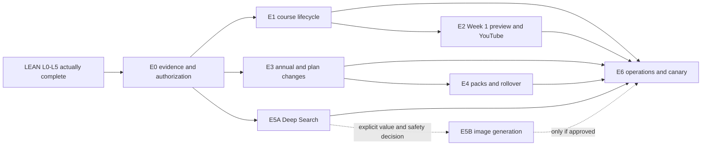

# Prismarium post-LEAN full expansion roadmap

**Date:** August 12, 2026

**Status:** Scenario rebaseline for planning only; not an active execution tracker

**Planning assumption:** All `LEAN-L0` through `LEAN-L5` packets have passed their actual exit gates, including the cost study, production canary, public launch, and initial stabilization.

**Current factual status:** The [lean membership implementation tracker](prismarium-membership-implementation-tracker.md) remains authoritative. This scenario does not mark unfinished LEAN work complete, authorize production changes, or approve deferred offers.

**Sources:** [Lean membership launch plan](prismarium-lean-membership-launch-plan-2026-08-06.md) and the historical [full expansion blueprint](prismarium-membership-credits-development-plan-2026-08-06.md)

## 1. Executive answer

The original full-system estimate was approximately **50–70 focused engineering days from scratch**. A completed LEAN program would already provide most of the difficult foundation:

- production security and fail-closed authority;
- monthly Reader/Student/Scholar/Adept catalog and billing projection;
- safe monthly Checkout, webhook, portal, and reconciliation;
- the 10/30/100/300 monthly credit core;
- atomic reserve, commit, release, stale recovery, wallet reads, and privacy-safe telemetry;
- metered Working and Seven Lenses actions;
- protected generation bypasses and kill switches;
- basic pricing, account, wallet, and tool-cost UI;
- a real cost study, production canary, launch, and initial monitoring.

That means the post-LEAN job is not another 50–70 days of rebuilding the same system. The remaining full expansion rebaselines to:

| Scenario | Points | Focused engineering effort | Calendar reality |
|---|---:|---:|---|
| Core full expansion, excluding image generation | **68** | **34–50 days** | Roughly 7–10 focused weeks for one developer |
| All-in original vision, including image generation | **73** | **38–56 days** | Roughly 8–12 focused weeks for one developer |
| Evidence and price calibration | Ongoing | 2–3 analysis days at each review | Requires real 30/60/90-day customer windows |

These are effort ranges, not deadlines. Course production remains a separate track. Some course, billing, and operational work can overlap evidence collection, but safety dependencies cannot be skipped.

## 2. What LEAN would already cover

| Original full-system phase | State after assumed LEAN completion | Remaining delta |
|---|---|---|
| 0. Security and production preflight | Substantially covered | Re-audit only when an expansion introduces new authority |
| 1. Canonical schema and catalog | Covered for monthly lean scope | Add annual, pack, allocation, debt, and course-lifecycle schema |
| 2. Stripe state machine | Covered for monthly new-sale/cancel/reactivate flow | Annual billing, paid plan changes, proration, broader refund/dispute handling |
| 3. Credit ledger and grants | Core covered | Multi-grant allocation, rollover, purchases, refunds, disputes, and debt |
| 4. AI metering | Working and Seven Lenses covered | Versioned Deep Search cache/metering; optional image generation |
| 5. Course lifecycle | Narrow one-course launch access only | Active/paused/completed state, switching, downgrade effects, multiple releases |
| 6. Week 1 preview and YouTube | Public preview and durable saves covered narrowly | Purpose-built signed-in Week 1, carry-forward, course-video administration |
| 7. Customer UI | Lean pricing/account/wallet/tool states covered | Pack, switch, downgrade, annual, Deep Search, and expanded dashboard states |
| 8. Migration, shadow, and canary | Covered for lean scope | Repeat only for each new expansion module and its backfill |
| 9. Public founding launch | Covered for lean monthly launch | Incremental launch gates for annual, packs, additional courses, and Deep Search |
| 10. Evidence and optimization | Begun by LEAN | Continues at 30, 60, and 90 days and after every expansion |

## 3. Expansion program at a glance

Only `done` points would count if this scenario later becomes an active tracker. For now, every packet below is `planned`.

| Phase | Outcome | Points | Effort | Nature |
|---|---|---:|---:|---|
| E0 | Post-launch evidence and expansion authorization | 3 | 2–3 days | Required gate |
| E1 | Course access lifecycle and Student switching | 12 | 6–9 days | Required before a second paid course |
| E2 | Interactive Week 1 preview and YouTube integration | 9 | 5–7 days | Product expansion |
| E3 | Annual billing and safe paid plan changes | 12 | 6–9 days | Evidence-triggered monetization |
| E4 | Credit packs, rollover, refunds, and debt | 14 | 7–10 days | Evidence-triggered monetization |
| E5A | Versioned Deep Search cache and metering | 8 | 4–6 days | Evidence-triggered tool expansion |
| E5B | Persisted, moderated image generation | 5 | 4–6 days | Optional; explicit approval required |
| E6 | Operations, customer rights, trust, and expansion canary | 10 | 4–6 days | Required for full expansion launch |
| **Core expansion total** | Excludes E5B image generation | **68** | **34–50 days** | |
| **All-in total** | Includes optional E5B | **73** | **38–56 days** | |

## 4. Dependency order

The practical default sequence is E0 → E1 → E2, with E3/E4 starting only when billing demand justifies them. E5A can run alongside the course stream after its cost and cache gate. E5B is never assumed merely because the original blueprint mentioned image generation.

## 5. Phase E0 — post-launch evidence and expansion authorization

**Outcome:** Convert real LEAN launch behavior into a ranked expansion decision instead of building every deferred feature by inertia.

**Effort:** 2–3 focused days, using customer data collected over real 30/60/90-day windows.

| Packet | Points | Work | Exit gate |
|---|---:|---|---|
| `EXP-E0-01` | 3 | Produce a privacy-safe 30-day baseline for conversion, retention, plan mix, credit utilization/exhaustion, repeated top-ups requested, course preview/activation, provider COGS, support load, billing failures, and feature requests. Record `proceed`, `hold`, or `revise` for E1–E5. | Jen accepts a dated expansion decision matrix; no deferred price or feature becomes approved merely by appearing in this roadmap. |

### Required decisions

- Is a second paid course close enough to release that Student switching is now required?
- Are customers asking for annual prepayment often enough to justify E3?
- Are legitimate users exhausting credits often enough to justify packs?
- Is monthly-reset anxiety affecting retention enough to justify rollover?
- Does Deep Search demand and provider cost support a metered release?
- Is there a real image-generation use case beyond novelty?
- Does Adept remain enabled, held, or revised after real heavy-use evidence?
- Has enough evidence accumulated to consider the future $19 Student cutover? The earliest intended decision window remains 60–90 days, not an automatic date.

## 6. Phase E1 — course access lifecycle and Student switching

**Outcome:** Make multiple paid-course releases safe without losing learner work or turning Student’s one-course rule into a cosmetic UI restriction.

**Effort:** 6–9 focused days.

| Packet | Points | Work | Exit gate |
|---|---:|---|---|
| `EXP-E1-01` | 3 | Add enforceable course `access_tier`, `availability_status`, preview/release/retirement dates, and migration-safe compatibility. Keep database `published` as discoverability rather than entitlement. | Fresh local and staged schemas agree; public preview, member release, and editorial status cannot be confused. |
| `EXP-E1-02` | 5 | Add service-owned active/paused/completed enrollment state, week progress, explicit completion, activation/pause/reactivation/completion RPCs, and course-limit enforcement. | Twenty simultaneous Student activations leave at most one active paid course; Scholar/Adept multi-course behavior and Reader denials pass. |
| `EXP-E1-03` | 4 | Add Student switch confirmation, Scholar/Adept-to-Student retained-course selection, Reader fallback, backfill dry run, and browser full stories. Preserve all Journal work, progress, annotations, and artifacts. | Old work survives switch/downgrade; paused content is protected; desktop/mobile/keyboard flows pass with zero unexplained backfill rows. |

### Why this comes first

E1 is the clearest product expansion because the trigger is objective: it becomes mandatory before releasing a second Student-paid course. It increases course value without requiring a new payment product.

## 7. Phase E2 — interactive Week 1 preview and YouTube integration

**Outcome:** Let signed-in learners genuinely experience a course before activation while keeping protected later weeks out of network payloads.

**Effort:** 5–7 focused days.

| Packet | Points | Work | Exit gate |
|---|---:|---|---|
| `EXP-E2-01` | 3 | Create explicit public-outline, signed-in-preview, and full-course serializers with allowlisted fields and network-payload tests. | Anonymous responses contain no protected prompt, exercise, digest, or later-week material. |
| `EXP-E2-02` | 3 | Build a real Week 1 learner mode with reading choices, one digest, workbook/Journal save, zero-credit alternatives, and automatic carry-forward after activation. It creates no enrollment or slot. | Signed-in preview save survives reload and appears in the activated course without copying data. |
| `EXP-E2-03` | 3 | Add validated course-video links, course/week assignment in admin UI, accessible external-link behavior, generative-practice validation, and responsive/keyboard verification. | Missing video never breaks a course; unsafe URLs and required unfunded AI practices fail publication validation. |

## 8. Phase E3 — annual billing and safe paid plan changes

**Outcome:** Expand billing only after monthly membership behavior is trustworthy, while preserving founding eligibility and avoiding duplicate subscriptions.

**Effort:** 6–9 focused days.

| Packet | Points | Work | Exit gate |
|---|---:|---|---|
| `EXP-E3-01` | 4 | Add and verify annual Student founding/standard, Scholar, and Adept offers. Annual members still receive monthly—not annual-lump—credit grants, with deterministic monthly subperiod anchors. | All annual Prices validate in the intended Stripe mode; Test Clock stories prove exactly one monthly allowance per subperiod. |
| `EXP-E3-02` | 5 | Add app-owned plan-change preview/confirm state, successful-payment upgrades, renewal-time downgrades, founding continuity/lapse rules, interval changes, allowance deltas, and course impact. | No second subscription; proration/effective date and retained-course effects agree across Stripe, database, wallet, and UI. |
| `EXP-E3-03` | 3 | Finalize seven-day delinquency/grace behavior, refund/dispute/correction rules for subscriptions, Terms language, and a full Stripe sandbox/Test Clock gate. | Duplicate/out-of-order/delayed events converge safely; unknown Prices quarantine; every terminal and recovery story reconciles once. |

### Historical prices under evaluation

| Offer | Historical full-blueprint price | Status in this scenario |
|---|---:|---|
| Student founding annual | $150/year | Proposed; requires E0 authorization and live Price verification |
| Student standard annual | $190/year | Proposed; new-customer cutover only after a separate 60–90-day decision |
| Scholar annual | $390/year | Proposed |
| Adept annual | $690/year | Proposed only if Adept remains economically enabled |

Pricing remains value- and evidence-based. The ten-month annual prices are hypotheses from the original blueprint, not commitments created by this rebaseline.

## 9. Phase E4 — credit packs, rollover, refunds, and debt

**Outcome:** Support legitimate tool-only and high-usage demand without corrupting the simple LEAN ledger or manufacturing upgrade pressure.

**Effort:** 7–10 focused days.

| Packet | Points | Work | Exit gate |
|---|---:|---|---|
| `EXP-E4-01` | 5 | Add reservation-to-grant allocations, earliest-expiring-first spend order, purchased-credits-last behavior, paid included-credit one-period rollover, 2× included caps, expiry, and exact release restoration. | Concurrency, rollover, expiry, cancellation, upgrade, and missed-period invariants pass without negative or rewritten history. |
| `EXP-E4-02` | 4 | Add safe pack catalog, one-time Checkout, idempotent purchase/fulfillment rows, receipts, delayed payment handling, and purchased non-expiring grants for verified accounts. | Double-click/retry/delayed Checkout produces one paid fulfillment and one grant; unpaid/expired sessions grant nothing. |
| `EXP-E4-03` | 5 | Add full/partial refund, dispute, reversal, debt/recovery, support adjustment, export/deletion policy, wallet breakdown, pack history, and insufficient-credit purchase UI. | Every reversal is compensating and auditable; spent refunded credits become debt rather than a negative balance or deleted history. |

### Historical pack hypotheses

| Pack | Historical price | Effective price per credit | Status in this scenario |
|---|---:|---:|---|
| 10 credits | $6 | $0.60 | Proposed only if exhaustion/tool-only demand is real |
| 30 credits | $16 | $0.53 | Proposed |
| 75 credits | $36 | $0.48 | Proposed |

Packs and rollover have separate evidence triggers. Pack demand does not automatically prove that rollover is desirable, and reset anxiety does not automatically prove that packs are the answer.

## 10. Phase E5A — versioned Deep Search cache and metering

**Outcome:** Offer fresh Deep Search without reopening a free provider-spend or user-poisoned cache bypass.

**Effort:** 4–6 focused days.

| Packet | Points | Work | Exit gate |
|---|---:|---|---|
| `EXP-E5-01` | 3 | Create a versioned, service-written cache with normalized key/model/retrieval/prompt/schema versions, expiry, invalidation, ownership/privacy rules, and rate-limited zero-credit reads. | Customers cannot write shared cache entries; stale or incompatible entries cannot masquerade as exact hits. |
| `EXP-E5-02` | 3 | Integrate fresh Deep Search through the shared adapter at the approved quote, with retrieval-only fallback, durable result, actual provider usage, and input-preserving failure states. | Exact cache hit charges 0; fresh usable result settles once; fallback/failure never incurs an unsupported charge. |
| `EXP-E5-03` | 2 | Run real-provider COGS, replay, concurrency, cache-poison, stale-cache, kill-switch, responsive, and production-canary stories. | The action receives `enable`, `hold`, or `revise`; lack of representative cost data is not a pass. |

The historical quote was 3 credits for a fresh synthesis. E0/E5 evidence may keep, revise, or hold it before customer copy changes.

## 11. Phase E5B — optional image generation

**Outcome:** If and only if there is a durable product use case, add one safely persisted and moderated image workflow rather than reopening generic image generation.

**Effort:** 4–6 focused days; excluded from the 68-point core total.

| Packet | Points | Work | Exit gate |
|---|---:|---|---|
| `EXP-E5-04` | 2 | Define the specific customer job, output ownership, storage lifecycle, moderation policy, provider/model, accessibility needs, actual unit cost, and approved quote. | Jen records `proceed`, `hold`, or `reject`; novelty or an old route is not sufficient evidence. |
| `EXP-E5-05` | 3 | Implement the one approved route behind the shared adapter, durable storage, moderation, deletion/export, telemetry, kills, and real-provider full-story verification. | No generic bypass exists; failed/moderated/unpersisted work charges nothing; provider COGS satisfies the approved threshold. |

The historical five-credit price is provisional and must be re-costed. Image generation remains absent from marketing until this entire phase passes.

## 12. Phase E6 — operations, customer rights, trust, and expansion canary

**Outcome:** Make the expanded system supportable and observable, then release each module through a reversible canary.

**Effort:** 4–6 focused days, plus monitoring.

| Packet | Points | Work | Exit gate |
|---|---:|---|---|
| `EXP-E6-01` | 3 | Add revenue/COGS, grants/spend/expiry/purchases, provider latency/failure, reservation age, Stripe mismatch, pack/refund/debt, and course activation/switch/completion dashboards plus alerts. | Operators can identify an unknown Price, stuck reservation, cost spike, wallet mismatch, or failed event before customer reports become the primary signal. |
| `EXP-E6-02` | 3 | Add restricted retry/reconcile/hold/compensating-adjustment tools, customer export/deletion coverage, pseudonymized required payment retention, support runbook, and final Terms language. | No admin tool edits/deletes ledger history or silently sets balances; customer rights and financial retention rules are reviewed. |
| `EXP-E6-03` | 2 | After one course has reliable explicit completion, add the optional non-accredited Prismarium Record of Completion with verification, correction, and reissue behavior. | Record agrees with authoritative completion evidence and makes no accredited, licensed, or professional-certification claim. |
| `EXP-E6-04` | 2 | Run module-by-module migration dry run, internal enforcement, production canary, rollback rehearsal, and initial monitoring for annual, course switching, packs, Deep Search, and optional image generation. | Seven clean reconciliation days, no unexplained membership/wallet/course difference, no stuck reservation, and explicit go/no-go per module. |

## 13. Recommended delivery waves

| Wave | Work | Focused effort | What can happen in parallel |
|---|---|---:|---|
| A | E0 evidence and authorization | 2–3 days | Course production and ordinary LEAN operations continue |
| B | E1 course lifecycle + E3 billing foundations | 12–18 days | Schema/design work may interleave; each stream retains its own gate |
| C | E2 previews + E4 credit commerce + E5A Deep Search | 16–23 days | Start only the E0-authorized streams |
| D | E6 operations, canaries, and stabilization | 4–6 days plus monitoring | Optional E5B may run only after its explicit decision |

For a single developer, the streams are sequenced within each wave; “parallel” means calendar overlap with evidence collection or course production, not simultaneous coding capacity.

## 14. Monetization decision rules

The expansion uses the existing Prism Credit value metric because greater generative use generally creates both greater customer value and greater provider cost. It does not use courses as a hidden usage meter.

| Expansion | Minimum evidence before build/enable |
|---|---|
| Annual plans | Stable monthly billing plus repeated customer desire to prepay; annual discount must support retention and cash flow rather than merely decorate pricing |
| $19 Student standard cutover | 60–90 days of billing reliability, activation, retention, course engagement, support, cost, and customer-reported value; founding members retain continuity |
| Credit packs | Repeated legitimate exhaustion or tool-only demand not well served by current tiers |
| Rollover | Evidence that reset anxiety or forfeiture materially harms trust, usage, or retention |
| Adept | Heavy-use data passes provider-cost and contribution-margin thresholds; insufficient evidence means hold |
| Deep Search | Versioned cache, trustworthy per-result COGS, and demonstrated customer value |
| Image generation | A specific durable use case, persistence/moderation design, willingness to pay, and acceptable real COGS |
| Completion record | Reliable explicit week/completion evidence and reviewed non-accredited language |

## 15. What “full original implementation” would mean

The expansion is complete only when all included modules satisfy these stories:

- Student can preview, activate, switch, complete, and review courses without losing work or exceeding one active paid course.
- Scholar/Adept can use multiple released courses, and downgrade effects are explicit and reversible until effective.
- Annual members receive monthly credit subperiods rather than a single annual stockpile.
- Paid upgrades, downgrades, founding continuity, delinquency, cancellation, refund, and dispute states reconcile exactly.
- Included rollover, purchased non-expiry, allocation, refund, dispute, and debt accounting preserve append-only history and never overspend.
- Packs fulfill exactly once, including delayed payment and retry stories.
- Deep Search charges zero for an exact versioned cache hit and the approved amount only for a durable fresh result.
- Any image generation is specific, persisted, moderated, metered, deletable/exportable, and independently killable.
- Public outline, signed-in Week 1, and full-course network payloads expose only their authorized fields.
- Pricing, billing, wallet, packs, tools, switching, downgrades, and completion work at mobile, desktop, keyboard-only, reduced motion, and 200% zoom.
- Operators have reconciliation, alerts, safe compensating tools, rollback switches, and a customer-support runbook.
- Each expansion module has a real canary and seven clean reconciliation days before broad enablement.

## 16. Explicit boundaries

Even in the all-in scenario, the following remain out of scope unless separately approved:

- unlimited AI claims;
- a special Reader boost separate from shared packs;
- purchasing course access with credits;
- Student switching cooldowns;
- guaranteed YouTube or creator-content cadence;
- accredited or professional certification claims;
- historical charging of old query records;
- editing or deleting ledger history rather than compensating it;
- enabling a feature merely because its code exists;
- automatic $19 cutover based only on elapsed time.

## 17. How to activate this roadmap later

When LEAN actually finishes and Jen wants to begin expansion:

1. Keep the completed LEAN tracker as historical launch evidence.
2. Revalidate this scenario against deployed schema, Stripe state, actual customer data, provider prices, and current product priorities.
3. Record E0’s dated `proceed`, `hold`, or `revise` decisions.
4. Create a separate expansion execution tracker using the 73-point packet catalog, but count only approved packets in the active denominator.
5. Mark exactly one packet `in_progress`; keep all new sales/actions default closed until their own exit gates pass.

This preserves the speed and simplicity of LEAN while making the larger original vision visible, measurable, and reversible.
